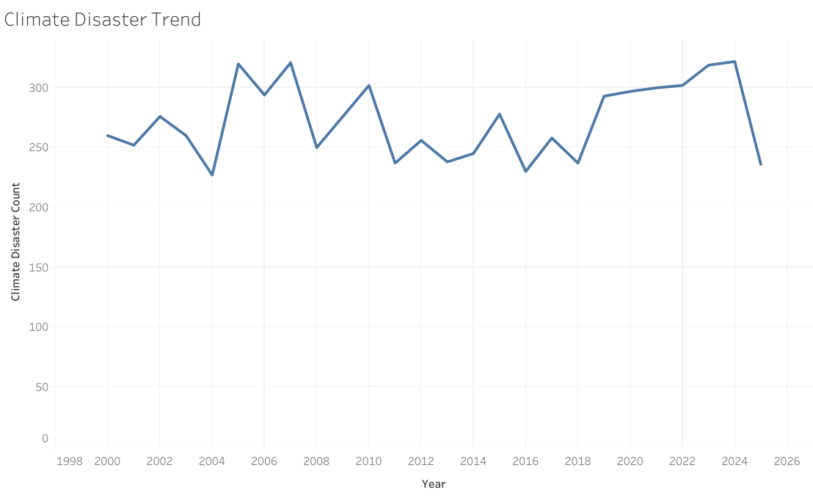
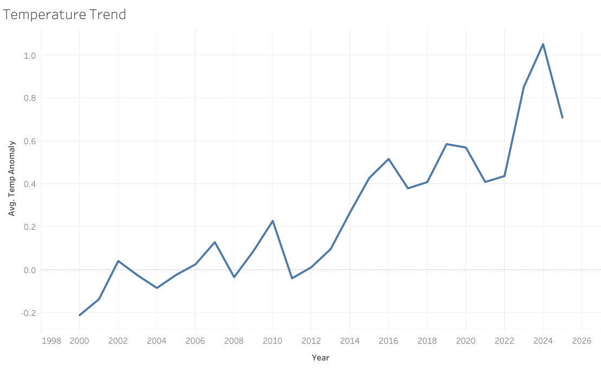
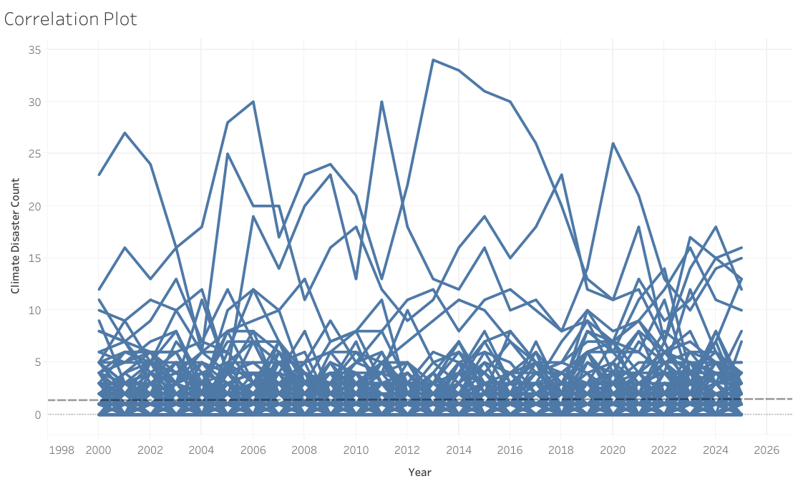

# Climate-Change-and-Natural-Disaster-Impact-Analytics
## Overview
This project analyzes the relationship between global temperature anomalies and natural disaster occurrences using historical climate and disaster datasets. The objective is to investigate whether rising temperatures are associated with increased disaster frequency and identify disaster categories with the greatest human and economic impact.

The project combines data engineering, ETL pipelines, data modeling, and Tableau Public visualizations to transform raw datasets into interactive analytical dashboards.

## Research Questions
- Is there a relationship between rising temperatures and climate disaster occurrences?
- Which natural disaster types have the greatest human or economic impact?

## Data Sources  
Emergency Events Database (EM-DAT), UCLouvain / CRED, Brussels, Belgium, accessed on 2025-06-26, https://www.emdat.be/  
Data Used:
- Disaster events
- Disaster classifications
- Country and year information
- Human impact metrics
- Economic damage metrics

Contains modified Copernicus Climate Change Service information (2026) – with major processing by Our World in Data. “Annual temperature anomalies” [dataset]. Contains modified Copernicus Climate Change Service information, “ERA5 monthly averaged data on single levels from 1940 to present 2” [original data]. Retrieved June 4, 2026 from https://archive.ourworldindata.org/20260518-093348/grapher/annual-temperature-anomalies.html (archived on May 18, 2026).  
Data Used:  
- Country-level annual temperature anomalies

## Technology Stack
- Python
- Panda
- Tableau Public
- Git/GitHub
- MS Excel

## Data Pipline  
Extract  
- Downloaded disaster records from EM-DAT
- Downloaded country-level temperature anomaly records from Our World in Data  
Transform
- Removed regional aggregate observations (e.g., NIAID regional entries)
- Filtered climate records to the 2000–2026 study period
- Standardized dataset structure
- Aggregated disaster records by country and year
- Filtered climate-related disaster categories
- Merged climate and disaster datasets using Country and Year keys  
Load
- Generated Tableau-ready analytical datasets for visualization and further analysis  

## Completed Features
- ETL Pipeline
- Exploratory Data Analysis
- Tableau Worksheets
- Tableau Dashboard

## Current Findings
Preliminary analysis found very weak linear correlations between annual temperature anomalies and climate disaster frequency at the country-year level. This suggests that climate disaster occurrence may be influenced by additional geographic, environmental, and socioeconomic factors beyond temperature anomalies alone. Further investigation is ongoing.

## In progress
- Disaster impact aggregation by disaster type
- Human impact analysis (deaths and affected populations)
- Economic impact analysis
- Additional Tableau dashboard development
- Geospatial disaster mapping